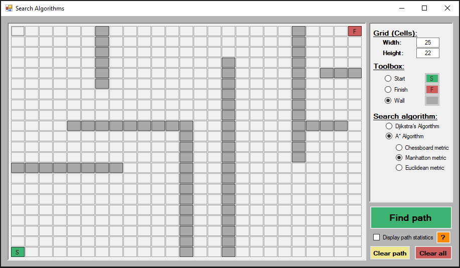
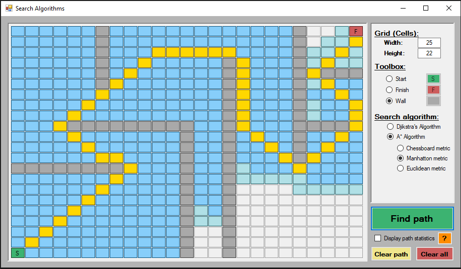
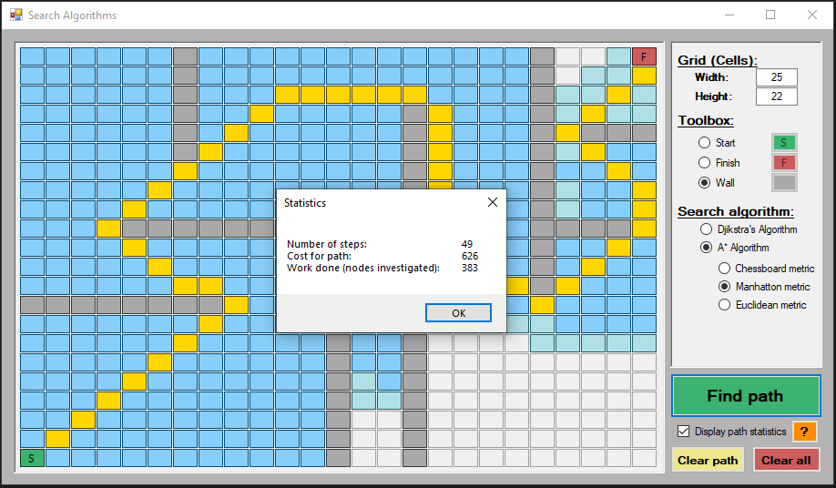
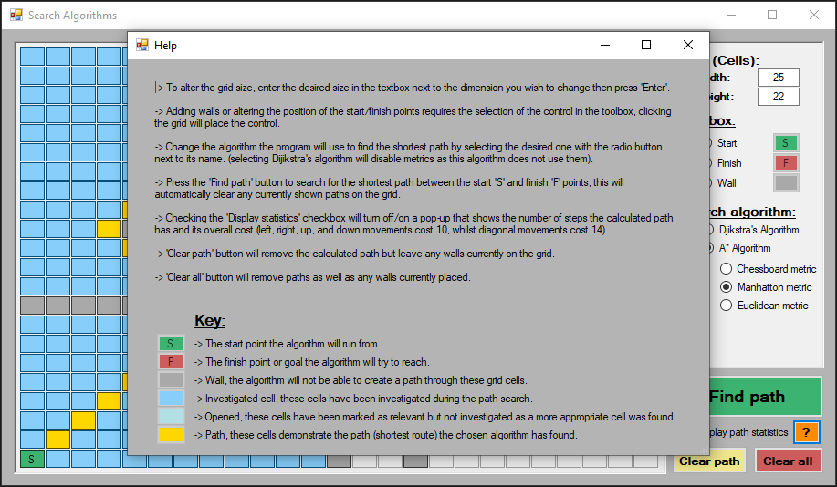

# path_finding

### Description
This is a C# WinForms project created as a simple way to visualise and compare A-star and Dijkstra's path finding algorithms and how the use of a different metric (a distance calculation that gives the algorithm a directional bias) can affect the computational work done by A-star.

### Screenshots

  
  &nbsp; &nbsp; &nbsp; &nbsp;
  

  
  &nbsp; &nbsp; &nbsp; &nbsp;
  

*Screenshot 1). A view of the UI with walls applied.*

*Screenshot 2). The previous picture with optimal path found and displayed.*

*Screenshot 3). Previous picture with path statistics shown.*

*Screenshot 4). Demonstration of the help page.*

(*full size images can be found [here](./screenshots)*)

### What was learnt

- Gained extra experience with WinForms.
- A better understanding of path finding algorithms. 

### Application instructions

The instructions given here can be found at any point by pressing the '?' button with the orange background in the bottom right corner of the application (demonstrated above in the fourth screenshot). This also provides a key to identify what is shown.

- To alter the grid size, enter the desired size in the textbox next to the dimension you wish to change then press 'Enter'.

- Adding walls or altering the position of the start/finish points requires the selection of the control in the toolbox, clicking the grid will place the control.

- Change the algorithm the program will use to find the shortest path by selecting the desired one with the radio button next to its name. (selecting Dijkstra's algorithm will disable metrics as this algorithm does not use them).

- Press the 'Find path' button to search for the shortest path between the start 'S' and finish 'F' points, this will automatically clear any currently shown paths on the grid.

- Checking the 'Display statistics' checkbox will turn off/on a pop-up that shows the number of steps the calculated path has and its overall cost (left, right, up, and down movements cost 10, whilst diagonal movements cost 14).

- The 'Clear path' button will remove the calculated path but leave any walls currently on the grid.

- The 'Clear all' button will remove paths as well as any walls currently placed.

### How to use

To run the application:
- Clone the repository.
- Double click the 'PathFinding.sln' file to open the project with Microsoft Visual Studio.
- Press the play button to run the application.
- Alternatively navigate to and run the 'Form1.cs' file.

Requirements:
- C# support
- .NETFramework, Version=v4.7.2
- Microsoft Visual Studio. This application will be runnable with alternative IDEs, such as Visual Studio Code, or via terminal but has been written and tested using Microsoft Visual Studio so alternative instructions have not been given.

### License
This is a demonstration project and not intended for collaboration, as such a license has not been added meaning the default copyright laws apply and no one may reproduce, distribute, or create derivative works from this work.
